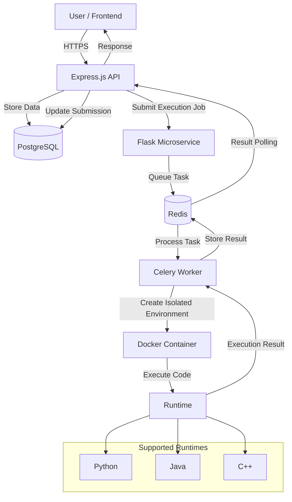

# Online Judge Platform 🏆

A comprehensive online competitive programming platform built with a modern microservices architecture, featuring automated code execution, containerized runtimes, real-time submission results, contests, and scalable background workers.

## 🎥 Demo
https://github.com/user-attachments/assets/50d7b4b1-0dcf-4900-b366-4cd385fec8b6

---

## 🌟 Highlights

* 🚀 Online code execution in multiple languages (C++, Python, Java)
* 🏗️ Microservices architecture separating API, queuing, and execution
* 🐳 Containerized, isolated Docker execution per submission
* ⚡ Real-time submission status via Server-Sent Events (SSE)
* 🏆 Problems, contests, team competitions, and live leaderboards
* 🔐 JWT-based authentication and role-based authorization
* 📈 Horizontally scalable background workers

---

## 🛠️ Technology Stack

<div align="center">


</div>

* **Node.js + Express.js** – Main API: auth, users, teams, problems, contests, submissions, results (exposed via SSE)
* **Flask + Celery** – Receives, queues, and processes execution requests
* **PostgreSQL** – Persistent storage (users, problems, contests, teams, submissions, results, standings)
* **Redis** – Message broker, task queue, and fast result cache
* **Docker & Docker Compose** – Multi-service orchestration and sandboxed code execution
* **Google Cloud Platform** – Hosting · **Let's Encrypt** – SSL · **GoDaddy** – DNS

---

## 🏗️ System Architecture



The Express API receives submission requests, hands off execution to the Flask/Celery/Docker pipeline, and streams results back to the frontend over SSE as workers complete jobs — keeping the API responsive regardless of execution time.

---

## 🐳 Docker Architecture

```text
                 ┌──────────────────┐
                 │    Frontend      │
                 └────────┬─────────┘
                          │
                          ▼
                 ┌──────────────────┐
                 │  Express API     │
                 └───────┬──────────┘
                         │
              ┌──────────┴──────────┐
              ▼                     ▼
       ┌──────────────┐      ┌──────────────┐
       │ PostgreSQL   │      │    Flask     │
       └──────────────┘      └──────┬───────┘
                                    │
                                    ▼
                              ┌────────────┐
                              │   Redis    │
                              └─────┬──────┘
                                    │
                                    ▼
                              ┌────────────┐
                              │   Celery   │
                              │   Worker   │
                              └─────┬──────┘
                                    │
                                    ▼
                            ┌─────────────────┐
                            │ Docker Sandbox  │
                            │                 │
                            │ C++ / Java /    │
                            │ Python          │
                            └─────────────────┘
```

Adding more Celery workers scales code execution horizontally as submission traffic grows.

---

## ✨ Features

**User Management** — registration, JWT auth, profile management, per-user submission history

**Problem Management** — create, browse, edit, delete problems; run against predefined test cases

**Multi-Language Execution** — isolated runtime per submission for C++, Python, and Java

**Online Judge** — outcomes include ✅ Accepted, ❌ Wrong Answer, ⚠️ Runtime Error, ⏱️ Time Limit Exceeded, 🔴 Compilation Error

**Contests & Teams** — contest creation and participation, contest problems, submission tracking, live standings, team-based competitions

**Leaderboards** — dynamic rankings from contest performance and submissions

**Security** — JWT auth, role-based authorization, password hashing, Docker sandboxing, resource limits, HTTPS

---

## 🔐 Code Execution Security

Each submission runs inside its own Docker container, isolated from the host and from other jobs. The sandbox enforces:

* CPU, memory, and execution time limits
* Filesystem and network restrictions
* Automatic container cleanup after execution

---

## 🧠 Key Engineering Challenges

| Challenge | Solution |
|---|---|
| Running untrusted code safely | Docker-based isolated execution with resource restrictions |
| Long-running submissions | Offload execution to asynchronous Celery workers |
| Concurrent submissions | Redis-backed task queues with horizontally scalable workers |
| Reliable result retrieval | Store execution state/results separately; retrieve asynchronously via SSE |
| Multi-service deployment | Docker Compose for orchestration, GitHub Actions for CI/CD |

---

## 📁 High-Level Structure

```text
my-oj/
│
├── database/
│   └── postgres.sql
├── node_backend/
│   ├── config/
│   ├── controllers/
│   ├── middlewares/
│   ├── models/
│   ├── routes/
│   ├── Dockerfile
│   └── server.js
├── flask_backend/
│   ├── load_problems/
│   ├── workers/
│   ├── Dockerfile
│   └── requirements.txt
├── docker-compose.yml
└── README.md
```

---

## 🚀 Backend Service (Node/Express)

The Express API manages users, teams, problems, submissions, results, leaderboards, event timing, and worker webhooks. Submission execution itself is handled by the Flask/Celery services in the repository; this service receives their webhook updates and exposes results through Server-Sent Events (SSE).

### Requirements

* Docker
* Docker Compose

### Start

From the repository root:

```bash
docker pull gcc:latest
docker pull python:3.9-alpine
docker pull eclipse-temurin:21-jdk
docker compose up --build
```

---

## 📚 Inspiration

Codeforces · LeetCode · AtCoder · HackerRank

The goal: a competitive programming interface backed by infrastructure capable of safely executing untrusted code at scale.

---

## 👨‍💻 Author

**Maitreya Vaidya**
GitHub: [@maitreya-16](https://github.com/maitreya-16)

## ⭐ Support

If you found this project interesting, consider giving the repository a ⭐.

[⭐ Star the Repository](https://github.com/maitreya-16/my-online-judge)

---

<div align="center">

### Built with ❤️ and a lot of code

**Online Judge Platform**

</div>
